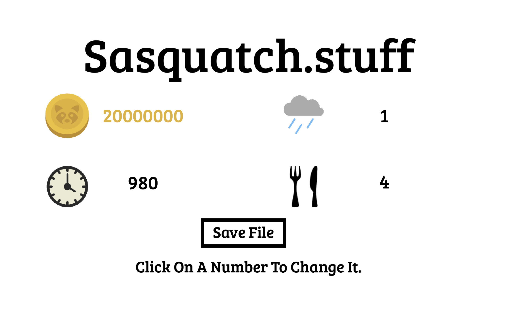

## Sneaky Sastools
A Sneaky Sasquatch Save Editor

## How to use

## Locating your save file

Go to your macintosh hd location on your mac then open the Users folder. In there, click your name. Press ⌘ + Shift + . after that, a folder called Library should show up. In Library, search up "com.rac7.SneakySasquatchMac." Open the folder at the path /Users/(YOUR USERNAME)/Library/Containers/com.rac7.SneakySasquatchMac/Data/Library/Application Support/com.rac7.SneakySasquatchMac/. Now you have all of the files you need.

## Downloading The Program
Go [Here](https://github.com/ikyih/SneakySastools/releases/).

## Screenshots 

